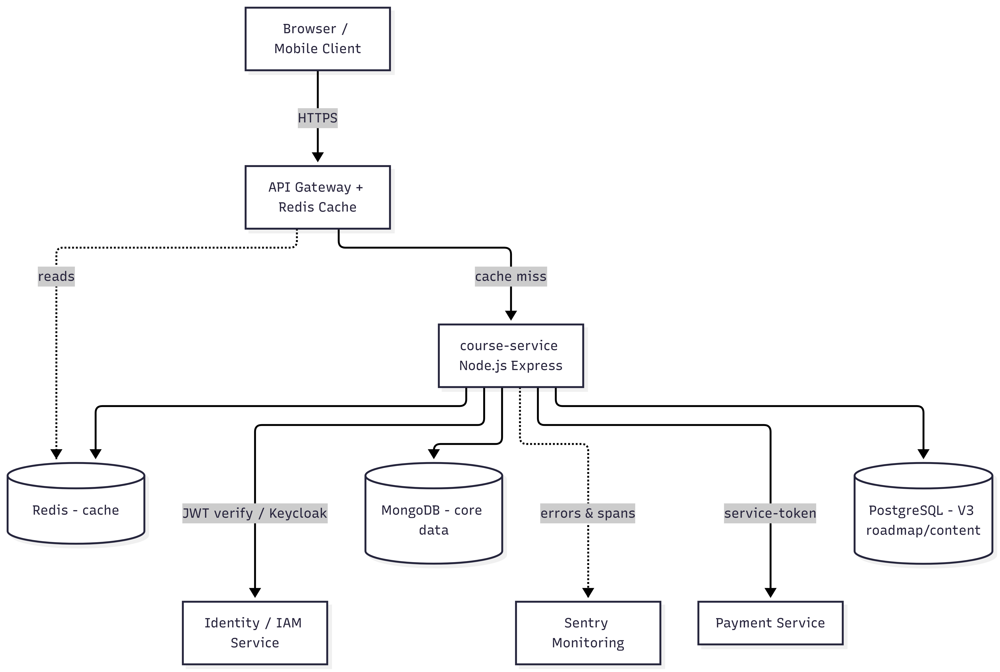
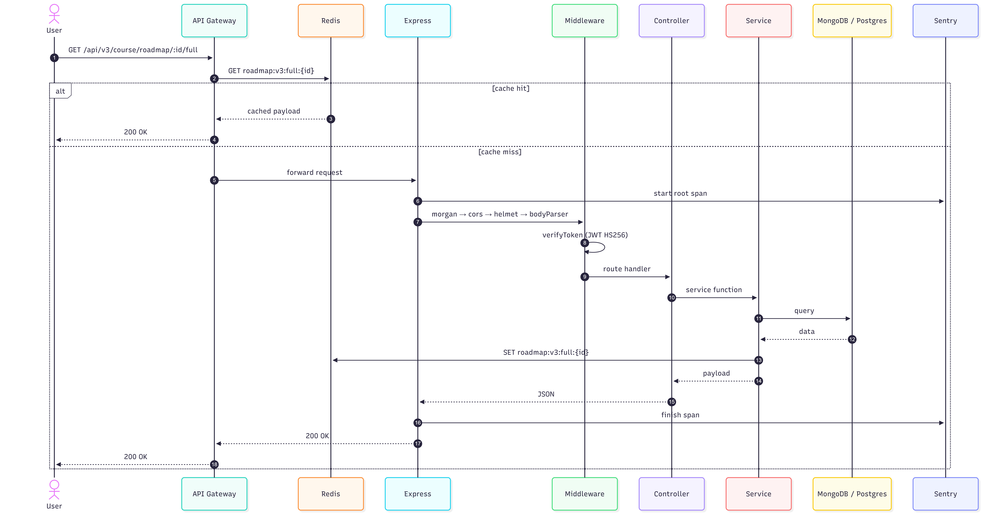
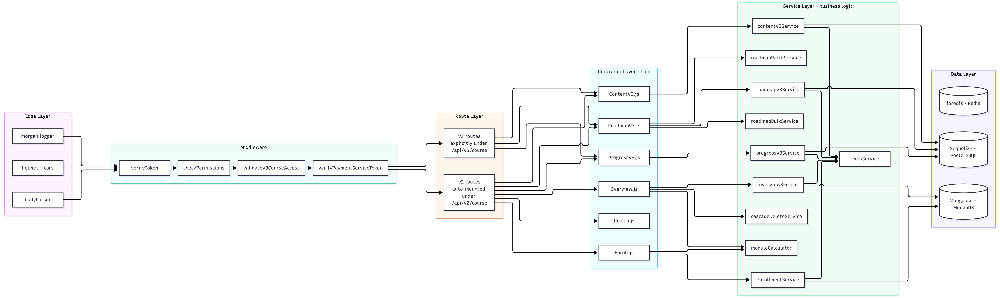
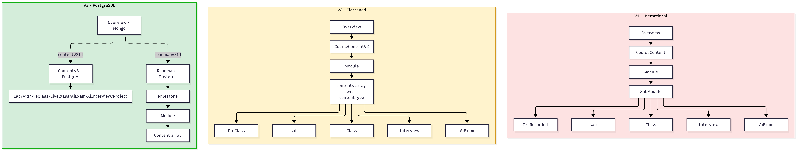
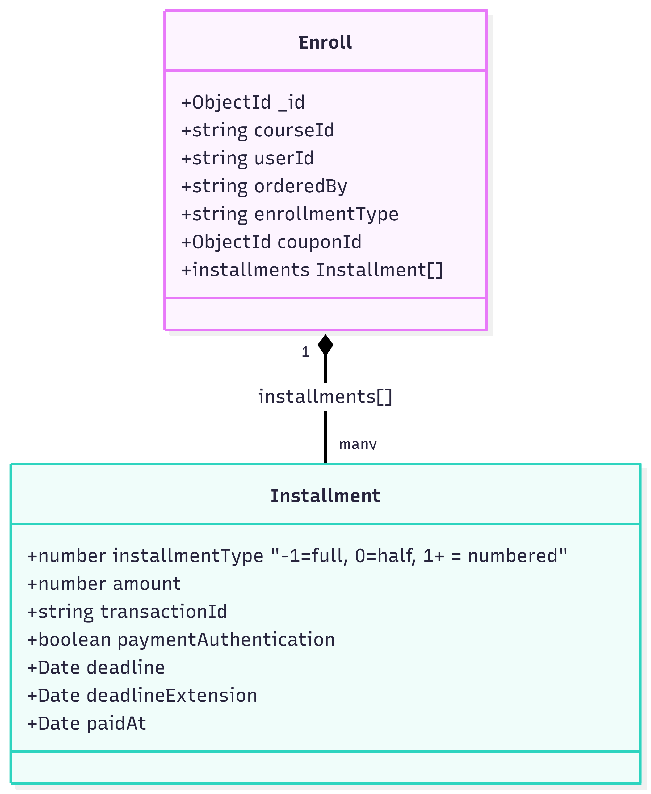
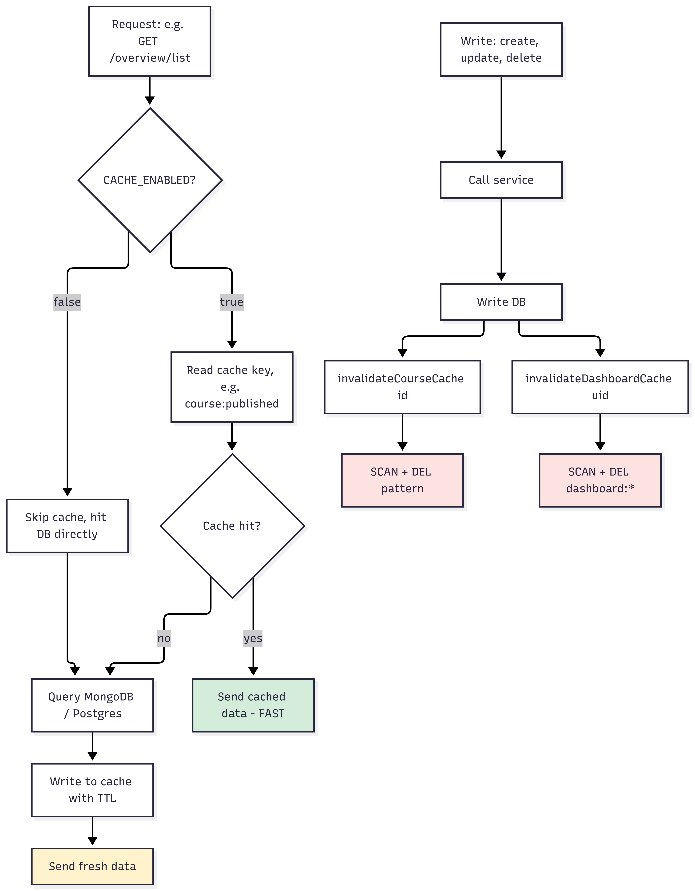
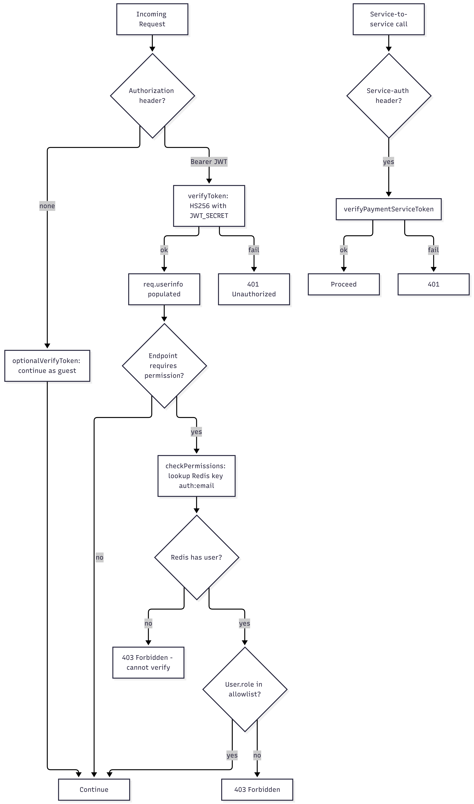
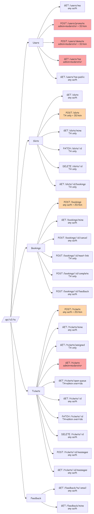
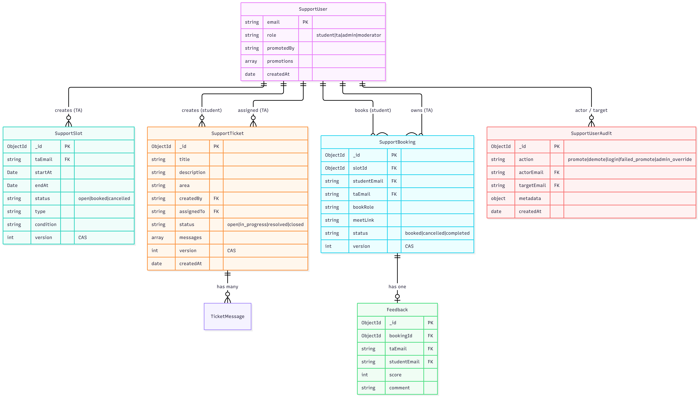

# ta-backend + course-service — Combined Architecture & Flow Notes

> Unified reference for the two Poridhi platform microservices. `ta-backend` owns `/api/v2/ta/*` (TA support business rules). `course-service` owns every other course rule (`/api/v2/course/*` + `/api/v3/course/*`).

---

## Table of Contents

**Part A — ta-backend (this service)**
0. [Reference Images](#0-reference-images)
1. [Stack Overview](#1-stack-overview)
2. [Architecture: Request Pipeline](#2-architecture-request-pipeline)
3. [Models (MongoDB)](#3-models-mongodb)

**Part B — course-service (diagrams)**
4. [High-Level System Architecture](#4-high-level-system-architecture)
5. [Request Lifecycle (End-to-End)](#5-request-lifecycle-end-to-end)
6. [Layered Internal Architecture](#6-layered-internal-architecture)
7. [MongoDB Data Model Relationships](#7-mongodb-data-model-relationships)
8. [PostgreSQL V3 Roadmap Schema](#8-postgresql-v3-roadmap-schema)
9. [V1 / V2 / V3 Course Content Comparison](#9-v1--v2--v3-course-content-comparison)
10. [Enroll + Installment (New Consolidated Design)](#10-enroll--installment-new-consolidated-design)
11. [Redis Caching — Cache-Aside Flow](#11-redis-caching--cache-aside-flow)
12. [Auth & Authorization Flow](#12-auth--authorization-flow)
13. [Module Access Logic](#13-module-access-logic)
14. [API Route Map](#14-api-route-map)
15. [Cascade Delete Tree](#15-cascade-delete-tree)
16. [V3 Roadmap Patch vs Bulk Update](#16-v3-roadmap-patch-vs-bulk-update)
17. [Sentry Observability Pipeline](#17-sentry-observability-pipeline)
18. [Deployment / Boot Sequence](#18-deployment--boot-sequence)

**Part C — ta-backend diagrams**
19. [Per-Request Sequence](#19-per-request-sequence)
20. [supportAuth Decision Tree](#20-supportauth-decision-tree)
21. [RBAC Route Map](#21-rbac-route-map)
22. [Data Model (ER)](#22-data-model-er)
23. [Security Layers (Defense in Depth)](#23-security-layers-defense-in-depth)

**Part D — Cross-service & shared concerns**
24. [Cross-Service Interaction](#24-cross-service-interaction)
25. [Shared JWT / Redis / Sentry Boundary](#25-shared-jwt--redis--sentry-boundary)

**Part E — Reference**
26. [Layout](#26-layout)
27. [Env Contract](#27-env-contract)
28. [Dev Workflow](#28-dev-workflow)
29. [How to view these diagrams](#29-how-to-view-these-diagrams)

---

# Part A — ta-backend

## 0. Reference Images

Your own diagrams live alongside this doc in `images/`:

- `images/architecture_diagram.png` — High-level system architecture (course-service context) — §4
- `images/auth_flow.png` — Auth & authorization flow — §12
- `images/installments_enroll.png` — Enroll + Installment class diagram — §10
- `images/Layerd_internel.png` — Layered internal architecture of course-service — §6
- `images/models.png` — MongoDB data model relationships (course-service) — §7
- `images/models.svg` — Data model diagram (ta-backend, vector) — §22
- `images/postfresmodels.png` — PostgreSQL V3 roadmap schema — §8
- `images/rbac.svg` — RBAC / role hierarchy (ta-backend, vector) — §21
- `images/redic.png` — Redis cache-aside flow — §11
- `images/request_lifecycle.png` — End-to-end request lifecycle (sequence) — §5
- `images/TA_DataModel.png` — ta-backend data model (ER) — §22
- `images/version_comparison.png` — V1 / V2 / V3 course content comparison — §9

Each image is embedded in its referenced section.

---

## 1. Stack Overview

| Layer            | Technology                     | Notes                                                                                          |
| ---------------- | ------------------------------ | ---------------------------------------------------------------------------------------------- |
| Runtime          | Node.js 20 + Express 4         | Entry file `server.js`, default port **4001**                                                   |
| Database         | **MongoDB** (mongoose)         | DB: `course_svc2` · Collections prefixed `support_*`                                          |
| Cache            | **Redis** (`ioredis`)          | Rate-limit store (`keyGenerator` per-user / per-IP), optional caching via `services/redisService` |
| Auth             | **JWT** (`jsonwebtoken`)       | Shared `JWT_SECRET` with `lab-info-backend` (enforced by boot guard as parity check)           |
| API docs         | swagger-ui-express          | Mounted at `/api-docs` from `config/swaggerConfig.js`                                          |
| Logging          | **Winston**                    | `utils/logger.js` — used by middleware (e.g. `supportAuth.js`) and error utilities            |
| Error tracking   | `@sentry/node`                 | `instrument.js` loaded FIRST. PII-scrubbed (`beforeSend`, `beforeBreadcrumb`, `beforeSendTransaction`) |
| Security         | Helmet (CSP) · cors · morgan · body-parser | CSP `connect-src` allowlist driven by env vars                                        |
| Rate limiting    | `express-rate-limit`           | Per-IP `authLimiter` (router-level) and per-user limits on mutations                           |
| Testing          | jest + supertest               | Test path pattern: `__tests__/ta`                                                              |

### Endpoints exposed

| Mount                | Purpose                              | Auth / Limits                              |
| -------------------- | ------------------------------------ | ------------------------------------------ |
| `/api/v2/ta/*`       | Support router (`support.js`)         | `authLimiter` (10/min/IP) + JWT + user-limits |
| `/api-docs`          | Swagger UI                           | Public                                     |
| `/health`, `/ready`  | Liveness / readiness (DB ping)       | No auth, no rate limit                     |
| `/debug-sentry`      | Sentry smoke endpoint                | Public (dev only)                          |
| `/api/v2/ta/*` (mock)| Offline mock router                  | When `USE_MOCK_SUPPORT=true`               |

---

## 2. Architecture: Request Pipeline

The request flows through the following stages in order:

1. **Edge middleware** — `Sentry span` → `morgan` → `bodyParser` → `cors` → `deleteReferer` → `helmet` (with CSP `connect-src` allowlist).
2. **Router** — the request is matched under `/api/v2/ta`.
3. **`authLimiter`** — coarse per-IP rate limit of **10 requests/min** (per-IP safety net).
4. **`verifyToken`** — `jwt.verify(JWT_SECRET)`. Populates `req.userinfo = { email, role, ... }`. Returns **401** on invalid or missing token.
5. **`supportAuth`** — loads the `SupportUser` row by email and applies one of three policies:
   - `supportAnyAuth` — load user and pass through.
   - `supportTAOnly` — require `role === 'ta'`; otherwise **403**.
   - `supportTAOnlyWithAdminOverride` — allow TA, or admin/moderator via JWT (writes an `admin_override` audit row).
6. **Per-user rate limiter** — keyed `u:{email}` with fallback `ip:{ip}`. Limiters applied per route:
   - `slotCreateLimiter` — **30/min** on `POST /slots`.
   - `ticketCreateLimiter` — **20/min** on `POST /tickets`.
   - `bookingCreateLimiter` — **20/min** on `POST /bookings`.
   - `adminRoleLimiter` — **10/min** on `POST /users/{promote,demote}`.
7. **Controller** — `controllers/supportController.js` runs the business logic. It uses `utils/supportGuards.js` helpers such as `assertSlotOwner`, `assertBookingTA`, and CAS (optimistic concurrency on the `version` field). Hits Mongoose models → MongoDB.
8. **Sentry error handler** (on unhandled error, registered **LAST**) — `Sentry.setupExpressErrorHandler(app)` runs `beforeSend: scrubEvent` (PII redaction), reports the event to Sentry, and returns **500** to the client.


---

## 3. Models (MongoDB)

All collections live in `course_svc2` DB. Indexes are listed per model.

### 3.1 `SupportUser`
```js
{
  email:      String,   // identity key (lowercased + trimmed)
  role:       'student' | 'ta' | 'admin' | 'moderator',
  promotedBy: String,   // email of admin who granted the role
  promotions: [         // promotion history
    { by: String, at: Date, role: String }
  ],
  name:       String,
  createdAt:  Date,
}
```
**Indexes:** `{ email: 1 }` (unique)

### 3.2 `SupportSlot`
```js
{
  taEmail:   String,
  startAt:   Date,      // 30-min time slot
  endAt:     Date,
  status:    'open' | 'booked' | 'cancelled',
  type:      String,    // e.g. 'office_hours' | '1on1' | 'review'
  condition: String,    // e.g. topic / area requirement
  version:   Number,    // CAS counter (optimistic concurrency)
}
```
**Indexes:** `{ taEmail: 1, startAt: 1 }` · 30-min slot granularity enforced by controller

### 3.3 `SupportBooking`
```js
{
  slotId:      ObjectId,    // ref -> SupportSlot._id
  studentEmail: String,
  taEmail:      String,
  bookRole:     String,     // student role at booking time
  meetLink:     String,     // set later by TA
  status:       'booked' | 'cancelled' | 'completed',
  version:      Number,     // CAS counter
}
```
**Indexes:** `{ slotId: 1 }`, `{ studentEmail: 1 }`

### 3.4 `SupportTicket` (Classic Helpdesk)
```js
{
  title:       String,
  description: String,
  area:        String,           // e.g. 'frontend' | 'backend' | 'devops'
  createdBy:   String,           // student email
  assignedTo:  String,           // TA email (nullable)
  status:      'open' | 'in_progress' | 'resolved' | 'closed',
  messages: [                    // Q&A thread
    { from: String, body: String, at: Date }
  ],
  version:     Number,         // CAS counter
  createdAt:   Date,
}
```
**Indexes:** `{ status: 1, createdAt: 1 }`

### 3.5 `Feedback`
```js
{
  bookingId:  ObjectId,    // ref -> SupportBooking._id
  taEmail:    String,
  studentEmail: String,
  score:      Number,      // 1..5
  comment:    String,
}
```
**Indexes:** `{ taEmail: 1, score: 1 }`

### 3.6 `SupportUserAudit`
```js
{
  action:    'promote' | 'demote' | 'login' | 'failed_promote' | 'admin_override',
  actorEmail: String,
  targetEmail: String,
  metadata:  Object,        // route, jwtRole, supportRole, reason, etc.
  createdAt: Date,
}
```

---

# Part B — course-service (diagrams)

> Diagrams in this part come from `course-service/ARCHITECTURE_DIAGRAMS.md`. They visualize the larger course service that `ta-backend` complements.

## 4. High-Level System Architecture



**What this shows:** The service sits behind an API Gateway, owns MongoDB + PostgreSQL + Redis, and talks to peer services (Payment, IAM). Sentry is observability, not in the happy path.

- **Client → HTTPS → API Gateway** with Redis cache.
- On **cache hit** the gateway returns the cached payload directly.
- On **cache miss** the request is forwarded to **course-service** (Node.js Express).
- course-service reads/writes **MongoDB** (core data), **PostgreSQL** (V3 roadmap/content), and **Redis** (cache).
- course-service also calls **Identity / IAM** (JWT verify / Keycloak) and **Payment Service** (service-token auth).
- Errors and spans are reported to **Sentry**.

---

## 5. Request Lifecycle (End-to-End)



**Steps in the sequence (cache-miss path):**

1. `User` → `API Gateway` — `GET /api/v3/course/roadmap/:id/full`.
2. `API Gateway` → `Redis` — `GET roadmap:v3:full:{id}`.
3. **[cache hit]** Redis returns the cached payload → gateway returns `200 OK` to user.
4. **[cache miss]** `API Gateway` → `Express` — `forward request`.
5. `Express` → `Sentry` — `start root span`.
6. `Express` → `Middleware` — `morgan → cors → helmet → bodyParser`.
7. `Middleware` self-call — `verifyToken (JWT HS256)`.
8. `Middleware` → `Controller` — `route handler`.
9. `Controller` → `Service` — `service function`.
10. `Service` → `MongoDB / Postgres` — `query`.
11. DB returns `data` to Service.
12. `Service` → `Redis` — `SET roadmap:v3:full:{id}`.
13. `Service` → `Controller` — `payload`.
14. `Controller` → `Express` — `JSON`.
15. `Express` → `Sentry` — `finish span`.
16. `Express` → `API Gateway` — `200 OK`.
17. `API Gateway` → `User` — `200 OK`.

---

## 6. Layered Internal Architecture



The diagram is organised as five left-to-right layers feeding into a data layer on the right:

- **Edge Layer** — `morgan logger`, `helmet + cors`, `bodyParser`.
- **Middleware** — `verifyToken` → `checkPermissions` → `validateV3CourseAccess` → `verifyPaymentServiceToken`.
- **Route Layer** — `v3 routes` (explicitly under `/api/v3/course`) and `v2 routes` (auto-mounted under `/api/v2/course`).
- **Controller Layer (thin)** — `ContentV3.js`, `RoadmapV3.js`, `ProgressV3.js`, `Overview.js`, `Health.js`, `Enroll.js`.
- **Service Layer (business logic)** — `contentV3Service`, `roadmapPatchService`, `roadmapV3Service`, `roadmapBulkService`, `progressV3Service`, `overviewService`, `cascadeDeleteService`, `moduleCalculator`, `enrollmentService`.
- **Data Layer** — `ioredis - Redis`, `Sequelize - PostgreSQL`, `Mongoose - MongoDB`, with `redisService` sitting between services and Redis.

**Flow direction:** Edge → Middleware → Route → Controller → Service → Data.

---

## 7. MongoDB Data Model Relationships


**Entities and key relationships:**

- **CATEGORY** — `ObjectId _id`, `string name`, `array courses (ObjectId[] -> Overview)`.
- **INSTRUCTOR** — `ObjectId _id`, `string name`, `string designation`, `string image`, `array courses (ObjectId[] -> Overview)`.
- **OVERVIEW** (the main "course" model) — fields include `title`, `description`, `category[]`, `price`, `early_price`, `installments[]`, `preRegisterInstallments[]`, `syllabus[]`, `faq[]`, `instructors[]`, `courseContent` (→ COURSECONTENT_V1), `courseContentV2` (→ COURSECONTENT_V2), `useContentV2`, `useContentV3`, `contentV3Id` (FK → Postgres), `roadmapV3Id` (FK → Postgres), `isPublished`, `order`.
- **COURSECONTENT_V1** — `ObjectId _id`, `overviewId`, `modules (subModule[labs|classes|prerecorded|interviews|aiExams])`.
- **COURSECONTENT_V2** — `ObjectId _id`, `overviewId`, `modules (contents[{contentType,order}])`.
- **ENROLL** — `ObjectId _id`, `courseId (string)`, `userId`, `orderedBy`, `enrollmentType (regular | preRegister)`, `installments (consolidated payments)`, `couponId (→ COUPON)`.
- **COUPON** — `ObjectId _id`, `code`, `courseId (string)`, `installments[]`.
- **REFUND** — `ObjectId _id`, `name`, `email`, `phone`, `description`, `image` (standalone, optional link to ENROLL).

**Cardinality summary:**

- `CATEGORY 1—* OVERVIEW` (via `courses[]`).
- `INSTRUCTOR 1—* OVERVIEW` (via `instructors[]`).
- `OVERVIEW 1—0..1 COURSECONTENT_V1` (when `useContentV2=false`).
- `OVERVIEW 1—0..1 COURSECONTENT_V2` (when `useContentV2=true`).
- `OVERVIEW 1—* ENROLL` (via `courseId` string).
- `COUPON *—* ENROLL` (via `couponId`).
- `REFUND *—* ENROLL` (optional, standalone refund request).

---

## 8. PostgreSQL V3 Roadmap Schema


**Why two DBs?** Mongo holds the class-level catalogue (one doc per class). Postgres holds the relational roadmap tree where drag-and-drop reordering needs strict transactional consistency.

**Entities (Postgres / Sequelize):**

- **ROADMAP** — `uuid id`, `string courseId (matches Overview.roadmapV3Id)`, `array milestones (UUID[])`.
- **MILESTONE** — `uuid id`, `uuid roadmapId`, `string title`, `array modules (UUID[])`, `array milestone_story (UUID[])`, `int order`.
- **MILESTONE_STORY** — `uuid id`, `uuid milestoneId`, `string content`, `int order`.
- **MODULE** — `uuid id`, `uuid milestoneId`, `string title`, `array contents (UUID[])`, `array topics (UUID[])`, `array labs (UUID[])`, `int order`.
- **CONTENT** — `uuid id`, `uuid moduleId`, `string type (lab|topic|class|preClass)`, `uuid labId`, `uuid topicId`, `int order`.
- **TOPIC** — `uuid id`, `uuid moduleId`, `string name`.
- **LAB** — `uuid id`, `uuid moduleId`, `string name`.
- **CONTENTV3** — `uuid id (matches Overview.contentV3Id)`, `string courseId`, `array contents (UUID[])`.
- **CONTENT_V3_CONTENT** — `uuid id`, `uuid contentV3ModuleId`, `string type`, `json info`, `int order`.
- **CONTENT_V3_LAB / PRECLASS / LIVECLASS / AIEXAM / AIINTERVIEW / PROJECT** — each `uuid id` + `json` payload (`labData`, `videoData`, `scheduleData`, `examData`, `interviewData`, `projectData`).

**Cardinality summary:**

- `ROADMAP 1—* MILESTONE` (via `milestones[]`).
- `MILESTONE 1—* MILESTONE_STORY` and `MILESTONE 1—* MODULE`.
- `MODULE 1—* CONTENT` (via `contents[]`), `MODULE 1—* TOPIC` (via `topics[]`), `MODULE 1—* LAB` (via `labs[]`).
- `CONTENT 1—0..1 LAB` (if `type=lab`) and `CONTENT 1—0..1 TOPIC` (if `type=topic`).
- `CONTENTV3 1—* CONTENT_V3_CONTENT` (via `contents[]`).
- `CONTENT_V3_CONTENT 1—0..1` to each content type table (`LAB`, `PRECLASS`, `LIVECLASS`, `AIEXAM`, `AIINTERVIEW`, `PROJECT`).

---

## 9. V1 / V2 / V3 Course Content Comparison



**V1 — Hierarchical (legacy):**

- `Overview` → `CourseContent` → `Module` → `SubModule`.
- SubModule branches into `Lab`, `Class`, `PreRecorded`, `Interview`, `AiExam`.

**V2 — Flattened (active for legacy courses):**

- `Overview` → `CourseContentV2` → `Module` → `contents array` (each item has a `contentType`).
- The contents array branches into `PreClass`, `Lab`, `Class`, `Interview`, `AiExam`.

**V3 — PostgreSQL (active for new courses):**

- `Overview (Mongo)` references a `roadmapV3Id` and a `contentV3Id` into Postgres.
- `Roadmap - Postgres` → `Milestone` → `Module` → `Content array`.
- `ContentV3 - Postgres` → `Lab / Vid / PreClass / LiveClass / AiExam / AiInterview / Project`.

| Generation | Store | Shape | Use today? |
|---|---|---|---|
| V1 | MongoDB | Overview → modules → subModule → {labs, classes, …} | Legacy |
| V2 | MongoDB | Overview → modules → contents[{contentType, order}] | Active for legacy |
| V3 | MongoDB + PostgreSQL | Mongo overview + Postgres Roadmap tree + Postgres ContentV3 | Active for new courses |

---

## 10. Enroll + Installment (New Consolidated Design)



**Enroll fields:** `ObjectId _id`, `string courseId`, `string userId`, `string orderedBy`, `string enrollmentType`, `ObjectId couponId`, `installments Installment[]`.

**Installment fields:** `number installmentType` (`-1`=full, `0`=half, `1+`=numbered), `number amount`, `string transactionId`, `boolean paymentAuthentication`, `Date deadline`, `Date deadlineExtension`, `Date paidAt`.

**Relationship:** `Enroll "1" *-- "many" Installment : installments[]`.

**Why consolidated?** Before, each installment was a separate row — hard to compute "how much has user X paid for course Y". Now one Enroll doc holds the full payment history.

---

## 11. Redis Caching — Cache-Aside Flow



**Read path (cache-aside):**

1. Request arrives (e.g. `GET /overview/list`).
2. Decision: `CACHE_ENABLED?`
   - **false** → Skip cache, hit DB directly.
   - **true** → Read cache key (e.g. `course:published`).
3. `Cache hit?`
   - **yes** → Send cached data (FAST).
   - **no** → Query MongoDB / Postgres → write to cache with TTL → send fresh data.

**Write path (invalidation):**

1. Write happens (create / update / delete) → call service → write DB.
2. After DB write, two invalidation paths run:
   - `invalidateCourseCache id` → `SCAN + DEL pattern`.
   - `invalidateDashboardCache uid` → `SCAN + DEL dashboard:*`.

**Cache key patterns:**

| Key | TTL | Pattern |
|---|---|---|
| `auth:{email}` | none | external write |
| `user:{email}` | none | external write |
| `course:metadata` | 1h | invalidated on Overview write |
| `course:published` | 10m | invalidated on publish toggle |
| `course:detail:{id}` | 30m | invalidated on update/delete |
| `dashboard:my-courses:{uid}` | 5m | invalidated on enrollment change |
| `course:category` | 1h | invalidated on Category write |
| `roadmap:v3:*:{courseId}*` | per-call | invalidated on roadmap write |

---

## 12. Auth & Authorization Flow



**User-facing path (left side of the diagram):**

1. `Incoming Request` → `Authorization header?`
   - **none** → `optionalVerifyToken: continue as guest`.
   - **Bearer JWT** → `verifyToken: HS256 with JWT_SECRET`.
2. `verifyToken` outcome:
   - **ok** → `req.userinfo populated`.
   - **fail** → `401 Unauthorized`.
3. After population: `Endpoint requires permission?`
   - **no** → `Continue`.
   - **yes** → `checkPermissions: lookup Redis key auth:email`.
4. `Redis has user?`
   - **no** → `403 Forbidden - cannot verify`.
   - **yes** → `User.role in allowlist?`
     - **yes** → `Continue`.
     - **no** → `403 Forbidden`.

**Service-to-service path (right side of the diagram):**

1. `Service-to-service call` → `Service-auth header?`
   - **yes** → `verifyPaymentServiceToken`.
   - **ok** → `Proceed`.
   - **fail** → `401`.

**Note:** `checkPermissions` depends on Redis being populated externally by the auth/IAM service — if Redis is missing the entry, access is denied (fail-closed).

---

## 13. Module Access Logic

**Algorithm** — `calculateModuleLimit(overview, enrollmentType, auth, currentDate)`:

1. **Has full payment? (installmentType = -1)** → `limit = total modules`.
2. **Half payment? (installmentType = 0)** → `limit = total / 2 (rounded)`.
3. Otherwise, is the **course live?**
   - **no** → sum `module_number` from each authenticated installment → `limit = sum`.
   - **yes** → check the next unpaid deadline:
     - **deadline passed and no valid extension** → `limit = 0 - blocked`.
     - **deadline not passed (or valid extension)** → sum installments → `limit = sum`.
4. Call `getAccessibleModules(modules, limit)` to slice the module list.

**Why this matters:** A bug here means students see content they shouldn't (revenue loss) or are wrongly blocked (support tickets). Highest-impact code to test.

---

## 14. API Route Map

The course-service (port **4000**) exposes the following routes:

- **Root-level**
  - `GET /health` — liveness/readiness probe.
  - `GET /api-docs` — Swagger UI.
  - `GET /debug-sentry` — Sentry smoke endpoint (dev only).

- **`/api/v2/course`**
  - **overview**
    - `GET list` — list overviews.
    - `GET id` — get one overview.
    - `POST admin create` — create an overview (admin).
    - `PUT update-order` — update display order.
    - `PUT update` — update an overview.
    - `PATCH publish` — toggle the publish flag.
    - `DELETE cascade` — cascade-delete an overview.
  - `enroll`
  - `category`
  - `content v1`
  - `content v2`
  - `instructor`
  - `coupon`
  - `refund`
  - `roadmap legacy`

- **`/api/v3/course`**
  - **roadmap V3**
    - `GET full` — fetch the full roadmap tree.
    - `PATCH differential` — apply incremental ops.
    - `PUT bulk update` — replace the entire tree.
    - `order endpoints` — reorder subtrees.
  - `content V3`
  - `progress V3`

---

## 15. Cascade Delete Tree

**When you delete a Course Overview:**

1. Delete the Roadmap tree in Postgres.
2. Delete ContentV3 in Postgres.
3. Delete all Enroll documents.
4. For each Enroll: delete related Progress records.
5. Delete CourseContent v1.
6. Delete CourseContentV2.
7. Delete Coupons.
8. Unlink the course from `Category.courses[]`.

**When you delete an Enroll:** delete its related Progress records.

**When you delete a Milestone (Postgres):**

- Delete Milestone Stories.
- Delete its Modules.
  - For each Module: delete its `contents`, `topics`, and `labs`.

**All runs in a Postgres transaction for the V3 side.** Mongo cascade uses multiple operations (not a transaction) — potential partial-failure risk.

---

## 16. V3 Roadmap Patch vs Bulk Update

**Differential Patch (auto-save) — PATCH /roadmap/:id/patch**

1. Frontend Admin UI sends `PATCH /roadmap/:id/patch` with a small `ops[]` payload.
2. API validates the ops array.
3. API opens a Postgres transaction (`BEGIN TRANSACTION`).
4. For each op (milestone/module/content) the API performs create/update/delete.
5. API commits (`COMMIT`).
6. API invalidates Redis: `roadmap:v3:*:id`.
7. API returns `200` with a summary.

**Bulk Update (import / manual save) — PUT /roadmap/:id/bulk-update**

1. Frontend Admin UI sends `PUT /roadmap/:id/bulk-update` with the whole tree.
2. API validates the entire tree.
3. API opens a Postgres transaction.
4. API wipes and recreates the tree.
5. API commits.
6. API invalidates Redis: `roadmap:v3:*:id`.
7. API returns `200` with a summary.

| Aspect | Patch | Bulk Update |
|---|---|---|
| Payload | Small (ops[]) | Large (whole tree) |
| Use case | Auto-save, incremental | Import / full save |
| Speed | Fast | Slower |
| Conflict risk | Lower | Higher |
| Transaction | One | One |

---

## 17. Sentry Observability Pipeline

**Trace pipeline (left-to-right):**

1. `Incoming Request` → wrapped in a `withSpan` block.
2. The span enters the `Controller` → `Service`.
3. The Service emits a `dbQuery` span (hits `Mongo / Postgres`) and a `cacheOp` span (hits `Redis`).
4. The root span produces a `Transaction`.
5. Sampling is URL-based:
   - `/health` → **0% sample** (skipped).
   - `/admin/roadmap writes` → **100% sample**.
   - `content/roadmap reads` → **30% sample**.
   - `progress` → **20% sample**.
   - default → **10% sample**.
6. The sampled transaction is sent to Sentry.

**Error pipeline:**

1. `Exception` is raised.
2. The `beforeSend` hook runs `scrubEvent` (PII / token redaction).
3. The scrubbed event is sent to Sentry.

**PII scrubbing rules:**

- `beforeBreadcrumb`: redact HTTP URLs, emails, UUIDs, long opaque IDs.
- `beforeSend`: redact body/headers/cookies/query for keys like `password`, `token`, `authorization`, `email`, `phone`, JWT-shaped strings.

---

## 18. Deployment / Boot Sequence

**Step-by-step boot of course-service:**

1. `Node Process` → `require instrument.js FIRST` (so Sentry patches load hooks before anything else).
2. `instrument.js` initializes Sentry with the DSN and scrubbing config.
3. `Node Process` → `require server.js`.
4. `server.js` requires Sentry, then conditionally runs the bootstrap (`require.main === module`).
5. If bootstrap runs:
   - `Mongoose` connects (`connect(URI)`).
   - `Sequelize` authenticates with Postgres.
   - `ioredis` creates a client with lazy connect.
6. Express app is built.
7. Middleware is mounted: `helmet`, `cors`, `bodyParser`, `morgan`.
8. Swagger is mounted at `/api-docs`.
9. Health endpoint is mounted at `/health`.
10. v2 routes are auto-loaded.
11. v3 routes are mounted.
12. The Sentry error handler is registered **LAST**.
13. `app.listen(4000)` runs with auto-increment if the port is busy.
14. Process is `ready`.

---

# Part C — ta-backend diagrams

## 19. Per-Request Sequence

**Pipeline (left-to-right):**

`Client` → `Sentry Span` → `morgan` → `bodyParser` → `cors` → `helmet (CSP)` → `authLimiter (per-IP)` → `verifyToken` → `supportAuth` → `per-user rateLimiter` → `supportController` → `supportGuards` → `Mongoose Models`.

**Detailed steps:**

1. `Client → Sentry Span`: HTTP request enters and a `startSpan(op="http.server")` is opened.
2. `Sentry Span → morgan`: pass-through (`next()`).
3. `morgan → bodyParser`: log + `next()`.
4. `bodyParser → cors`: parse JSON (limit 1mb).
5. `cors → helmet`: origin allowlist check.
6. `helmet → authLimiter`: apply CSP + headers.
7. `authLimiter → Redis`: `INCR key u:ip:{ip}`.
   - **Over limit (10/min)** → respond `429` to client.
   - **Within limit** → `next()`.
8. `authLimiter → verifyToken`: `next()`.
9. `verifyToken`: `jwt.verify(JWT_SECRET)`.
   - **Invalid/missing** → `401`.
   - **Valid** → populate `req.userinfo = payload` and call `next()`.
10. `verifyToken → supportAuth`: `next()`.
11. `supportAuth → Mongoose`: `SupportUser.findOne(email)`.
    - If found → `req.supportUser = row`; if not → `req.supportUser = { role: 'student', _default: true }`.
12. `supportAuth`: applies `supportAnyAuth` / `TAOnly` / `AdminOverride` policy.
    - **Forbidden** → `403`.
    - **Allowed** → `next()`.
13. `supportAuth → per-user rateLimiter`: `next()`.
14. `per-user rateLimiter → Redis`: `INCR key u:{email}`.
    - **Over limit** → `429`.
    - **Within limit** → `next()`.
15. `per-user rateLimiter → supportController`: `next()`.
16. `supportController → supportGuards`: calls `assertSlotOwner` / `assertBookingTA` / CAS update.
17. `supportGuards → Mongoose`: query + (CAS) update; on success returns result to the controller.
18. `supportController` returns `2xx JSON` to the client.

**Error path (any unhandled error):**

- `Sentry error handler` runs `scrubEvent` (PII redaction) and returns `500` while reporting the event to Sentry.

---

## 20. supportAuth Decision Tree

**`supportAuth` middleware flow:**

1. `Start` → `loadSupportUser`: `SupportUser.findOne({ email })`.
2. `Found?`
   - **Yes** → `req.supportUser = row`.
   - **No** → `req.supportUser = { role: 'student', _default: true }`.
3. `Mode?` (which middleware variant was used)
   - `supportAnyAuth` → `next()` (allow).
   - `supportTAOnly` → check `role === 'ta'`:
     - **Yes** → `next()`.
     - **No** → `403 TA role required`.
   - `supportTAOnlyWithAdminOverride` → check `role === 'ta'` **or** `jwt.role` in `admin/moderator`:
     - **ta** → `next()`.
     - **admin/moderator** → set `_adminOverride = true` → write `SupportUserAudit.create({ action: 'admin_override' })` → `incAdminOverrideMetric` → `next()` via override.
     - **student** → `403 TA or admin override`.

**Styling legend (in the original diagram):**

- `Allow*` (green) — paths that pass through.
- `Deny*` (red) — `403` rejection paths.
- `Audit` (amber) — admin-override audit-write step.

---

## 21. RBAC Route Map



**`/api/v2/ta/` route tree:**

- **Users**
  - `GET /users/me` — any auth.
  - `POST /users/promote` — admin+moderator + 10/min.
  - `POST /users/demote` — admin+moderator + 10/min.
  - `GET /users/tas` — admin+moderator.
  - `GET /users/tas-public` — any auth.

- **Slots**
  - `GET /slots` — any auth.
  - `POST /slots` — TA only + 30/min.
  - `GET /slots/mine` — TA only.
  - `PATCH /slots/:id` — TA only.
  - `DELETE /slots/:id` — TA only.
  - `GET /slots/:id/bookings` — TA only.

- **Bookings**
  - `POST /bookings` — any auth + 20/min.
  - `GET /bookings/mine` — any auth.
  - `POST /bookings/:id/cancel` — any auth.
  - `POST /bookings/:id/meet-link` — TA only.
  - `POST /bookings/:id/complete` — TA only.
  - `POST /bookings/:id/feedback` — any auth.

- **Tickets**
  - `POST /tickets` — any auth + 20/min.
  - `GET /tickets/mine` — any auth.
  - `GET /tickets/assigned` — TA only.
  - `GET /tickets` — admin+moderator.
  - `GET /tickets/open-queue` — TA + admin override.
  - `GET /tickets/:id` — any auth.
  - `PATCH /tickets/:id` — TA + admin override.
  - `DELETE /tickets/:id` — any auth.
  - `POST /tickets/:id/messages` — any auth.
  - `GET /tickets/:id/messages` — any auth.

- **Feedback**
  - `GET /feedback/ta/:email` — any auth.
  - `GET /feedback/mine` — any auth.

- **Ping**
  - `GET /_ping` — health check.

**Styling legend (in the original diagram):** admin-only routes (red), TA-only routes with rate limit (orange), and standard any-auth routes (default).

---

## 22. Data Model (ER)




**Entities and relationships:**

- **SupportUser** is the root identity row.
- `SupportUser 1—* SupportSlot` (TA creates slots).
- `SupportUser 1—* SupportTicket` (student creates tickets).
- `SupportUser 1—* SupportTicket` (TA is assigned tickets).
- `SupportUser 1—* SupportBooking` (student books).
- `SupportUser 1—* SupportBooking` (TA owns the booking).
- `SupportBooking 1—0..1 Feedback`.
- `SupportTicket 1—* TicketMessage`.
- `SupportUser 1—* SupportUserAudit` (actor / target).

**Key fields:**

- **SupportUser** — `email PK`, `role (student|ta|admin|moderator)`, `promotedBy`, `promotions[]`, `createdAt`.
- **SupportSlot** — `_id PK`, `taEmail FK`, `startAt`, `endAt`, `status (open|booked|cancelled)`, `type`, `condition`, `version (CAS)`.
- **SupportBooking** — `_id PK`, `slotId FK`, `studentEmail FK`, `taEmail FK`, `bookRole`, `meetLink`, `status (booked|cancelled|completed)`, `version (CAS)`.
- **SupportTicket** — `_id PK`, `title`, `description`, `area`, `createdBy FK`, `assignedTo FK`, `status (open|in_progress|resolved|closed)`, `messages[]`, `version (CAS)`, `createdAt`.
- **Feedback** — `_id PK`, `bookingId FK`, `taEmail FK`, `studentEmail FK`, `score`, `comment`.
- **SupportUserAudit** — `_id PK`, `action (promote|demote|login|failed_promote|admin_override)`, `actorEmail FK`, `targetEmail FK`, `metadata`, `createdAt`.

---

## 23. Security Layers (Defense in Depth)

**Layered defenses (outside-in):**

1. **Reverse proxy** (LB) — first hop, terminates TLS, applies coarse-grained rules.
2. **Helmet (CSP `connect-src` allowlist)** — controls which URLs the browser/external code may call.
3. **CORS (origin allowlist)** — restricts which origins can call the API.
4. **authLimiter (10/min per IP)** — coarse per-IP rate limit on the support router.
5. **verifyToken (JWT verify)** — HS256 with `JWT_SECRET`; populates `req.userinfo`.
6. **supportAuth (role gate)** — `supportAnyAuth` / `supportTAOnly` / `supportTAOnlyWithAdminOverride`.
7. **per-user rateLimiter** — per-email caps on slot/ticket/booking/admin operations.
8. **supportGuards (assert + CAS)** — ownership checks plus optimistic concurrency on `version`.
9. **Sentry (PII-scrubbed error tracking)** — observes failures; PII is redacted in `beforeSend` / `beforeBreadcrumb`.

**Data stores behind the layers:** MongoDB and Redis.

---

# Part D — Cross-service & shared concerns

## 24. Cross-Service Interaction

**Frontend clients:**

- `ta-frontend` — calls ta-backend with JWT.
- `course-service frontend` — calls course-service with JWT.
- `admin-frontend-v4` — calls course-service and ta-backend with JWT.

**Backend services:**

- `course-service` on port **4000**.
- `ta-backend` on port **4001**.
- `lab-info-backend` — JWT verified by ta-backend (shared `JWT_SECRET`).
- `Payment Service` — course-service calls it with a service-token.
- `Identity / IAM` — course-service and ta-backend verify JWTs against it.

**Shared datastores:**

- `MongoDB` (ta-backend uses `support_*` collections; course-service uses core course collections).
- `PostgreSQL` (V3 roadmap / content, owned by course-service).
- `Redis` (shared rate-limit + cache).
- `Sentry` (shared project for both services).

**Key separation:** `ta-backend` and `course-service` share **JWT_SECRET** (boot guard enforced in ta-backend), share **Redis** (rate-limit + cache), and share **Sentry project** — but live in **separate MongoDB collections** (`support_*` vs core course collections). The legacy `/api/v2/course/support/*` route was retired in Phase 4; the support surface now lives only in `ta-backend` under `/api/v2/ta/*`.

---

## 25. Shared JWT / Redis / Sentry Boundary

**Shared infrastructure:**

- `Shared JWT_SECRET` (HS256) — used by both services.
- `Shared Redis` — rate-limit + cache.
- `Shared Sentry project` — PII-scrubbed.

**course-service (CS) uses the shared infra via:**

- `verifyToken` (HS256) — checks the shared `JWT_SECRET`.
- `checkPermissions` — looks up `auth:email` in Redis.
- `redisService` (ioredis) — Redis client.
- `instrument.js + Sentry` — initialises Sentry with scrubbing.

**ta-backend (TA) uses the shared infra via:**

- `verifyToken` (HS256) — same shared `JWT_SECRET`.
- `supportAuth` — `supportAnyAuth` / `supportTAOnly` / `supportTAOnlyWithAdminOverride`.
- `rateLimiter` — per-IP and per-user limiters backed by Redis.
- `instrument.js + Sentry` — initialises Sentry with scrubbing.

**Operational rule:** any user JWT minted by IAM is accepted by both services. Any TA role row in `support_users` is the source of truth for TA-only endpoints (course-service does NOT maintain TA roles — it only uses `admin`/`moderator` from the Redis `auth:{email}` cache).

---

# Part E — Reference

## 26. Layout

### `ta-backend/`

- `server.js` — entry: boot guard, Sentry, rate limit, route mount.
- `instrument.js` — Sentry init (PII-scrubbed).
- `config/`
  - `dbConfig.js`
  - `corsConfig.js`
  - `redis.js`
  - `swaggerConfig.js` — swagger-jsdoc → swagger-ui-express.
- `middleware/`
  - `tokenVerification.js` — `verifyToken` → `req.userinfo`.
  - `supportAuth.js` — `supportAnyAuth` / `supportTAOnly` / `supportTAOnlyWithAdminOverride`.
  - `checkPermission.js` — `checkPermissions(['admin','moderator'])`.
  - `rateLimiter.js` — slot / ticket / booking / admin-role limiters.
- `routes/`
  - `health.js` — `/health`, `/ready` (no auth).
  - `support.js` — `/api/v2/ta/*`.
- `controllers/`
  - `supportController.js`
- `models/`
  - `SupportUser.js` — email, role, promotedBy, promotions[].
  - `SupportSlot.js` — 30-min slots, version (CAS).
  - `SupportBooking.js` — slotId, bookRole, meetLink, version.
  - `SupportTicket.js` — helpdesk: title/desc/area + assignedTo/messages.
  - `Feedback.js` — bookingId, score, taEmail.
  - `SupportUserAudit.js` — promote/demote/login/failed/admin_override.
  - `supportIndex.js`
- `services/`
  - `redisService.js` — ioredis client (rate-limit + cache).
- `utils/`
  - `supportGuards.js` — assertSlotOwner, assertBookingTA, CAS.
  - `errorUtils.js`
  - `errorHandler.js`
  - `dbSpan.js`
  - `sentrySpan.js`
  - `logger.js` — winston.
- `mocks/`
  - `mockSupportRouter.js` — `USE_MOCK_SUPPORT=true`.
- `__tests__/`
- `images/` — reference diagrams (rbac.svg, models.svg, …).

### `course-service/`

- `server.js` — Main entry point (Express app + bootstrap).
- `instrument.js` — Sentry init (must load BEFORE `server.js`).
- `package.json` — Dependencies and scripts.
- `CLAUDE.md` — AI-friendly codebase notes.
- `README.md` — Original Redis workflow notes.
- `ARCHITECTURE_DIAGRAMS.md` — Visual companion (merged into this file).
- `config/` — Connection / setup files.
  - `dbConfig.js` — MongoDB connect.
  - `postgresConfig.js` — PostgreSQL (Sequelize) connect.
  - `redis.js` — Redis ioredis client.
  - `corsConfig.js` — CORS allowlist (env-driven).
  - `swaggerConfig.js` — OpenAPI spec builder.
  - `database.js` — Sequelize env-based config (legacy).
- `models/` — Mongoose schemas (MongoDB).
  - `Overview.js` — Main "course" model.
  - `Category.js` — Course categories.
  - `Instructor.js` — Course instructors.
  - `CourseContent.js` — v1 content: modules → subModule → labs/classes.
  - `CourseContentV2.js` — v2 content: modules → flat contents[].
  - `Enroll.js` — Enrollment + installment payments.
  - `Coupon.js` — Discount codes.
  - `Refund.js` — Refund requests.
  - `Roadmap.js` — Legacy roadmap (mostly unused now).
  - `postgres/` — Sequelize models (PostgreSQL V3).
- `routes/` — Express routers (URL → controller).
- `controller/` — HTTP request/response handlers.
- `Services/` — All business logic (DB calls, caching, etc.).
- `middleware/` — Auth, permission, V3 access checks.
- `utils/` — Helpers: logger, errors, sentry spans, module math.
- `migrations/` — MongoDB migrations (e.g., add `aiExams` array).
- `__tests__/` — Jest unit tests.
- `scripts/` — Dev utilities (dev-local, audit, etc.).
- `API-Doc/` — Old per-feature markdown API docs.
- `course-v3-docs/` — V1 vs V2 vs V3 comparison, V3 DB schema.
- `roadmap-docs/` — Roadmap V3 patch / bulk comparison guides.
- `Dockerfile` — Container build.
- `Makefile` — Dev convenience targets.
- `*.log` — Runtime logs (`combined.log`, `error.log`, `course.out.log`).

---

## 27. Env Contract

| Var                                  | Required       | Service            | Purpose                                                  |
| ------------------------------------ | -------------- | ------------------ | -------------------------------------------------------- |
| `NODE_ENV`                           | dev            | both               | `production` enables boot guard                          |
| `PORT`                               | yes            | ta-backend         | default **4001**                                         |
| `PORT`                               | yes            | course-service     | default **4000**                                         |
| `URI`                                | yes            | both               | Mongo connection string                                  |
| `JWT_SECRET`                         | yes            | both               | HS256 — parity enforced in ta-backend boot guard          |
| `LABINFO_JWT_SECRET`                 | yes            | ta-backend         | must match `JWT_SECRET` byte-for-byte                     |
| `PG_URL`                             | yes            | course-service     | PostgreSQL for V3 roadmap/content                        |
| `REDIS_HOST` / `REDIS_PORT`          | yes            | both               | Shared Redis                                             |
| `CORS_ALLOWED_ORIGINS`               | yes            | both               | Comma-separated                                          |
| `VITE_COURSE_API_URL`                | CSP            | both               | Helmet `connect-src`                                     |
| `VITE_LABINFO_API_URL`               | CSP            | both               | Helmet `connect-src`                                     |
| `VITE_TA_API_URL`                    | CSP            | both               | Helmet `connect-src`                                     |
| `VITE_ADMIN_API_URL`                 | CSP            | both               | Helmet `connect-src`                                     |
| `SENTRY_DSN`                         | yes (prod)     | both               | Empty in dev                                             |
| `USE_MOCK_SUPPORT`                   | optional       | ta-backend         | When `true`, mounts offline mock router                  |
| `CACHE_ENABLED`                      | optional       | course-service     | `"false"` disables Redis caching                         |
| `APP_VERSION` / `GIT_COMMIT_SHA`     | optional       | course-service     | Sentry release tagging                                   |
| `PAYMENT_SERVICE_KEY`                | yes            | course-service     | HS256 secret for inter-service tokens                    |
| `KEYCLOAK_*`                         | optional       | course-service     | OAuth flows                                              |
| `STUDENT_IAM_URL`                    | yes            | course-service     | Student identity service URL                             |
| `RATE_LIMIT_AUTH_PER_MIN`            | optional       | ta-backend         | default **10** · per-IP cap on `/api/v2/ta/*`            |
| `RATE_LIMIT_SLOT_CREATE_PER_MIN`     | optional       | ta-backend         | default **30** · per-user `POST /slots`                  |
| `RATE_LIMIT_TICKET_CREATE_PER_MIN`   | optional       | ta-backend         | default **20** · per-user `POST /tickets`                |
| `RATE_LIMIT_BOOKING_CREATE_PER_MIN`  | optional       | ta-backend         | default **20** · per-user `POST /bookings`               |
| `RATE_LIMIT_ADMIN_ROLE_PER_MIN`      | optional       | ta-backend         | default **10** · per-user promote/demote                 |

---

## 28. Dev Workflow

```bash
# ta-backend
cp .env.example .env
npm install
npm start                     # http://localhost:4001
# or
USE_MOCK_SUPPORT=true npm start    # offline (no Mongo)
# or
npm run dev                   # nodemon hot reload
npm test                      # jest + supertest

# course-service
cp .env.example .env
npm install
node server.js                # http://localhost:4000
# or
nodemon server.js             # hot reload
npm test                      # jest
```

**Probes:**

- ta-backend: `GET /health` · `GET /ready` · `GET /api-docs`
- course-service: `GET /health` · `GET /api-docs` · `GET /debug-sentry`

---

## 29. How to view these diagrams

- **VS Code**: open this file in preview — PNGs and SVGs render natively. (For any embedded Mermaid blocks, install the *Markdown Preview Mermaid Support* extension.)
- **GitHub / GitLab**: paste into any markdown file — diagrams render natively.
- **Obsidian / Notion / Typora**: native support.
- **CLI**: `npx -p @mermaid-js/mermaid-cli mmdc -i ARCHITECTURE.md` to generate PNGs from any Mermaid sources you may have.
